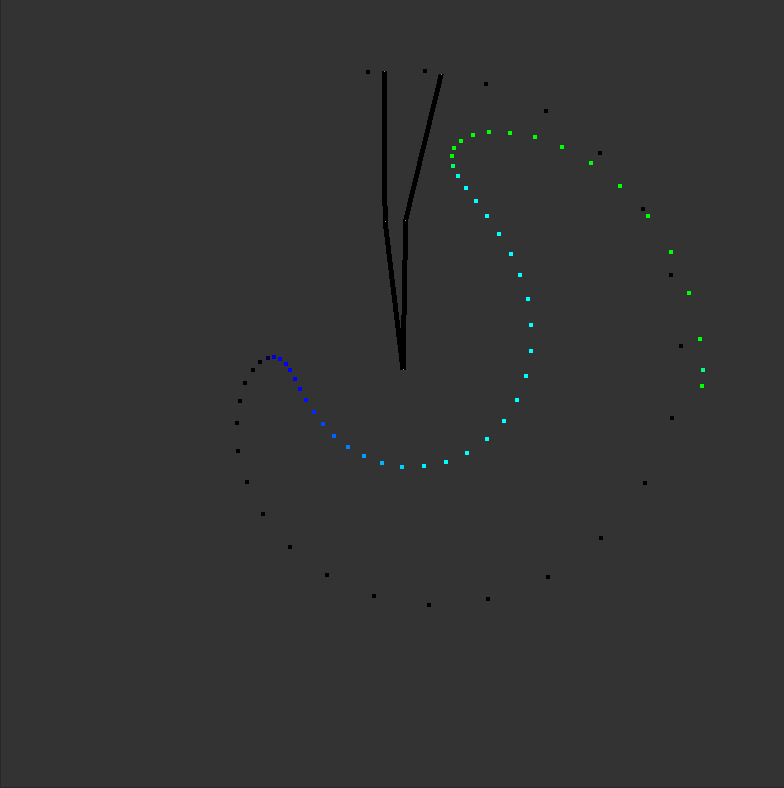
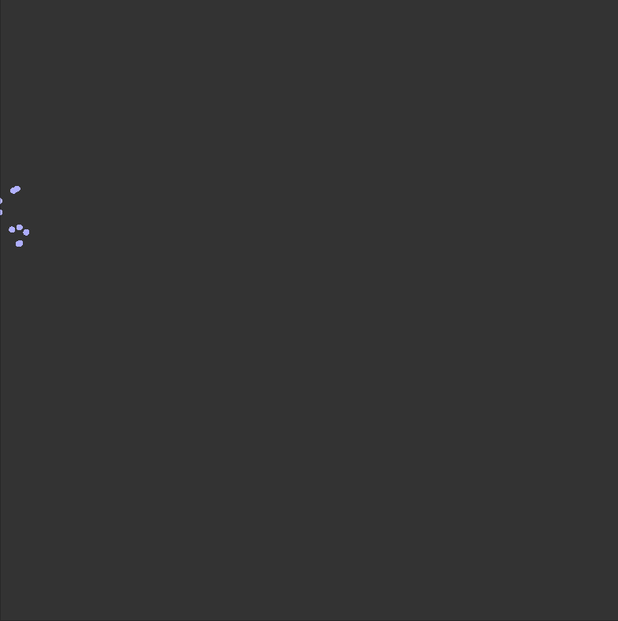
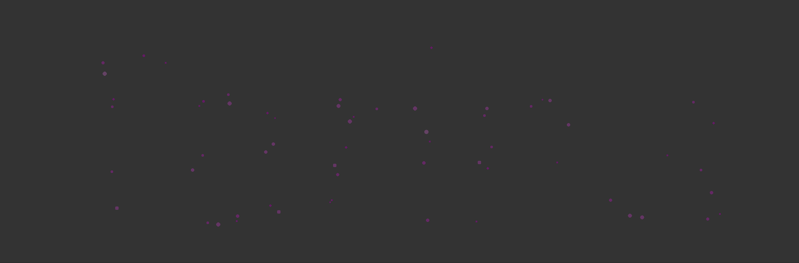

# TheVis
Visualization experiments and challenges in c#

## Chg001-SnakeGame

## Chg002-TrigonometryPillars

## Chg003-FireWorks

## Chg004-DoubleArmPainter

## Chg006-SunflowerNucleus

## Chg008-MagicWords

## Chg009-CircledSign
